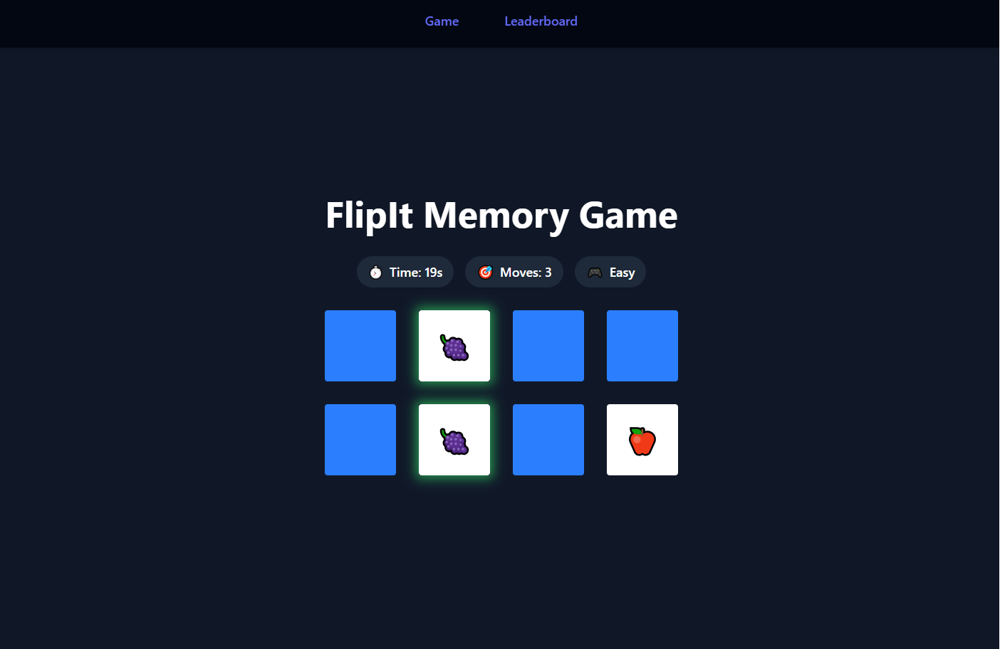

# FlipIt Memory Game
A fun and interactive memory game built with React and a minimal .NET backend. Match pairs of cards, track your score, and compete on the leaderboard — all in a modern, single-page experience.



---

## ✨ Features

- **Three difficulty modes:** Easy, Intermediate, Hard — each with unique grid sizes
- **Live leaderboard:** Compete for the best time and fewest moves
- **Responsive, beautiful UI:** Play on desktop or mobile
- **Sound effects:** Card flips, win/fail, and more
- **Instant feedback:** Animations and smooth gameplay
- **API-backed:** All scores and leaderboards are stored on a real backend

---

## 🚀 Quick Start

1. **Clone the repo:**
   ```sh
   git clone https://github.com/TeodorIliev06/flip-it.git
   cd flip-it/client
   ```
2. **Install dependencies:**
   ```sh
   npm install
   ```
3. **Start the client:**
   ```sh
   npm run dev
   ```
4. **(Optional) Start the server:**
   ```sh
   cd ../server/FlipIt.Server
   dotnet run
   ```

---

## 🛠️ Tech Stack

- **Frontend:** React, TypeScript, Vite, Tailwind CSS
- **Backend:** .NET Web API

---

## 📁 Project Structure

- `client/` — React frontend
- `server/` — .NET backend API

---

## 📝 License

MIT

---

## 🙏 Attributions

- Card Flip sound by f4ngy — [Freesound.org](https://freesound.org/s/240776/) — Licensed under [CC BY 4.0](https://creativecommons.org/licenses/by/4.0/)
